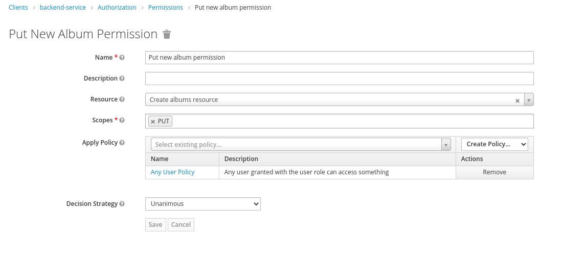

# Quarkus with Keycloak Authorization & Policy Enforcer

**Demo project to show Policy Enforcer error: newly created Keycloak resources are not found by policy enforcer.**

Based on Quarkus quick start
[Using Keycloak Authorization Services and Policy Enforcer to Protect JAX-RS Applications](https://github.com/quarkusio/quarkus-quickstarts/tree/main/security-keycloak-authorization-quickstart)

The application is a simple REST API that allows to manage albums.

- POST `/api/albums`
- GET `/api/albums/{id}`
- PUT `/api/albums/{id}`

Any authenticated user with `user` role can create album using `POST` or `PUT`.  
They can then access their own albums using `GET`.

Users with `admin` role can access all albums.

For each created album, the application creates in Keycloak:

- a resource `album:{id}` with uri `/api/albums/{id}` and `GET` scope
- a user policy `album:{id}:readers` with current user as member
- a scope permission `album:{id}:read` for
  - `album:{id}` resource
  - `album:{id}:readers` policy
  - `GET` scope

During `AlbumApiTest`, the album is well created, same for keycloak authz resource, policy & permission.   
But when I try to access the album using `GET`, I get a 403:

```text
DEBUG [org.key.ada.aut.AbstractPolicyEnforcer] Checking permissions for path [http://localhost:8081/api/albums/1] with config [PathConfig{name='album:1', type='album', path='/api/albums/1', scopes=[GET], id='1', enforcerMode='ENFORCING'}].
DEBUG [org.key.ada.aut.KeycloakAdapterPolicyEnforcer] Obtaining authorization for authenticated user.
DEBUG [org.key.ada.aut.KeycloakAdapterPolicyEnforcer] Authorization failed: java.lang.RuntimeException: org.keycloak.authorization.client.util.HttpResponseException: Unexpected response from server: 400 / Bad Request / Response from server: {"error":"invalid_resource","error_description":"Resource with id [1] does not exist."}
```

But when introspecting the RTP token, I see that `authorization` seems correct:

```json
{
  "authorization": {
    "permissions": [
      {
        "scopes": [
          "GET"
        ],
        "rsid": "1",
        "rsname": "album:1"
      },
      {
        "scopes": [
          "POST"
        ],
        "rsid": "a7603402-05ec-43ab-bc47-e8e7808769fd",
        "rsname": "Albums resource"
      },
      {
        "scopes": [
          "PUT"
        ],
        "rsid": "561a2d9d-8654-40c6-89df-7868599db78f",
        "rsname": "Create albums resource"
      }
    ]
  }
}
```

It seems the policy enforcer cannot find the newly created resource :-(

If I delete the

## Keycloak authorization config

Here is the default Keycloak authorization config [quarkus-realm.json](src/main/resources/quarkus-realm.json):

**Resources:**


 ```json
[
  {
    "name": "Albums resource",
    "uris": [
      "/api/albums"
    ],
    "scopes": [
      {
        "name": "GET"
      },
      {
        "name": "POST"
      }
    ]
  },
  {
    "name": "Create albums resource",
    "uris": [
      "/api/albums/{id}"
    ],
    "scopes": [
      {
        "name": "PUT"
      }
    ]
  }
]
```

**Policies & permissions:**




```json
[
  {
    "name": "Any User Policy",
    "description": "Any user granted with the user role can access something",
    "type": "role",
    "logic": "POSITIVE",
    "decisionStrategy": "UNANIMOUS",
    "config": {
      "roles": "[{\"id\":\"user\",\"required\":false}]"
    }
  },
  {
    "name": "Any Admin Policy",
    "description": "Any user granted with the admin role can access something",
    "type": "role",
    "logic": "POSITIVE",
    "decisionStrategy": "UNANIMOUS",
    "config": {
      "roles": "[{\"id\":\"admin\",\"required\":false}]"
    }
  },
  {
    "name": "Post new album permission",
    "type": "scope",
    "logic": "POSITIVE",
    "decisionStrategy": "UNANIMOUS",
    "config": {
      "resources": "[\"Albums resource\"]",
      "scopes": "[\"POST\"]",
      "applyPolicies": "[\"Any User Policy\"]"
    }
  },
  {
    "name": "Put new album permission",
    "type": "scope",
    "logic": "POSITIVE",
    "decisionStrategy": "UNANIMOUS",
    "config": {
      "resources": "[\"Create albums resource\"]",
      "scopes": "[\"PUT\"]",
      "applyPolicies": "[\"Any User Policy\"]"
    }
  }
]
```

